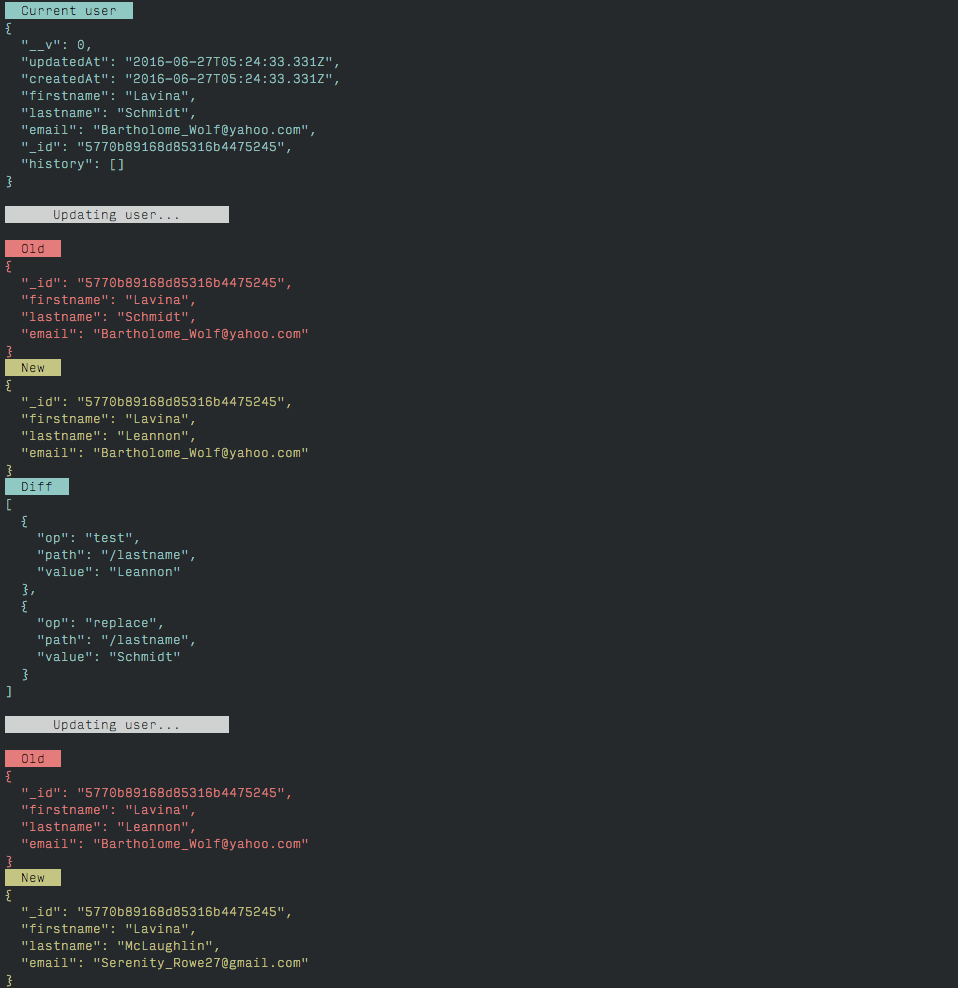
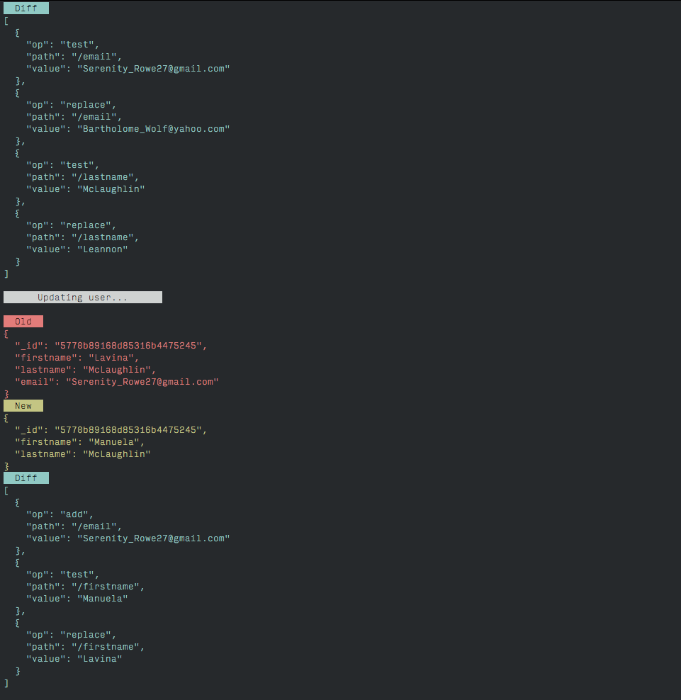
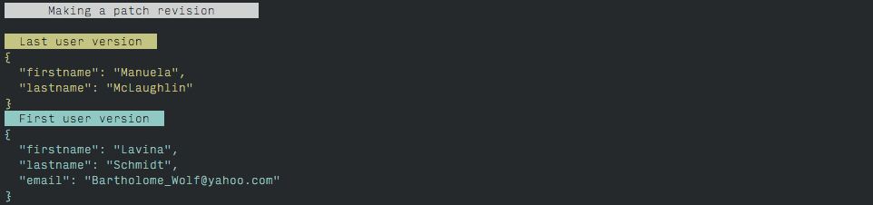

Example of MongoDB data versioning
==========================

Example of data versioning using [JSON Patch RFC6902](https://tools.ietf.org/html/rfc6902) with [jiff](https://github.com/cujojs/jiff).

## Run
 
```
$ npm install
$ node update.js
```

You will see:




